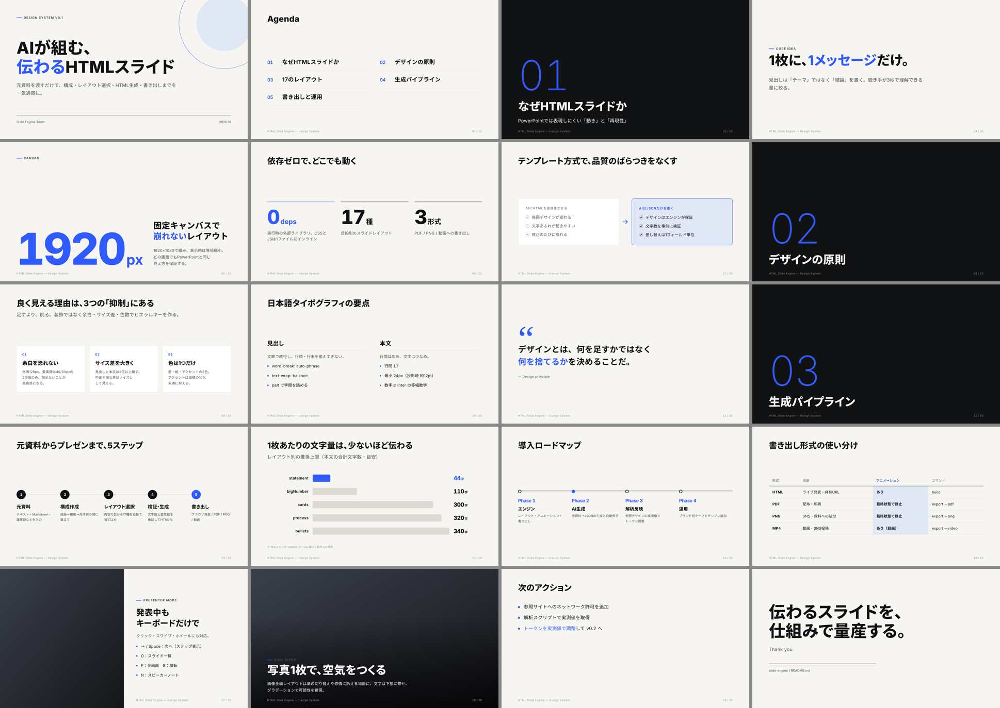

# Slide Engine

元資料を渡すと **構成 → レイアウト選択 → HTML 生成 → ブラウザで発表 → PDF / PNG / 動画** まで行う、HTML スライドの仕組み。
AI は JSON（何をどの型で見せるか）だけを書き、見た目はエンジンが保証する。



```bash
cd slide-engine
npm install

# サンプル（全 18 レイアウト）をビルドして開く
npm run sample && open examples/sample.html

# 元資料から生成（要 ANTHROPIC_API_KEY）
node src/generate.mjs ../docs/analysis-logic.md --audience "個人トレーダー" --minutes 10 --out out/fx

# JSON を手で書いた場合
node src/build.mjs my.deck.json

# 検査・書き出し（Playwright + Chromium、動画は ffmpeg）
node src/export.mjs out/fx.html --check
node src/export.mjs out/fx.html --pdf
node src/export.mjs out/fx.html --png
node src/export.mjs out/fx.html --video --dwell 3000
```

発表中の操作: `→` `Space` 次へ / `←` 戻る / `O` 一覧 / `F` 全画面 / `B` 暗転 / `N` ノート / クリック・スワイプ・ホイール。

## 成果物

| # | 内容 | 場所 |
|---|---|---|
| ① | Plume Deck 解析（手順・記入欄。**実測は未実施**、理由は文書内） | [docs/01-plume-deck-analysis.md](docs/01-plume-deck-analysis.md) / [tools/analyze-site.mjs](tools/analyze-site.mjs) |
| ② | デザインルール（なぜ良く見えるか・トークン） | [docs/02-design-rules.md](docs/02-design-rules.md) |
| ③ | スライドレイアウト一覧（18 種） | [docs/03-layouts.md](docs/03-layouts.md) |
| ④ | アニメーションルール | [docs/04-animation-rules.md](docs/04-animation-rules.md) |
| ⑤ | HTML/CSS/JS の設計 | [docs/05-architecture.md](docs/05-architecture.md) |
| ⑥ | 再利用可能なスライドエンジン | [engine/](engine/) / [src/](src/) |
| ⑦ | AI 生成ルール・プロンプト | [docs/07-ai-generation-rules.md](docs/07-ai-generation-rules.md) / [prompts/deck-system.md](prompts/deck-system.md) / [schema/deck.schema.json](schema/deck.schema.json) |

## 参照サイトの解析

```bash
node tools/analyze-site.mjs https://re-presentation.jp/tool/plume-deck.html analysis/plume-deck
```

DOM・CSS・JS・Network・イベントリスナー・アニメーション・タイポグラフィ実測・レスポンシブを `analysis/plume-deck/summary.md` にまとめる。
リポジトリ直下の `.mcp.json` に Chrome DevTools MCP を設定してあるので、Claude Code から対話的に調べることもできる。
